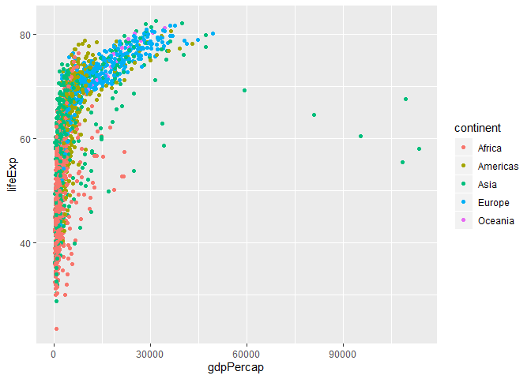

# Effective Visualizations

Now that you know how to create graphics and visualizations in R, you are armed with powerful tools for scientific computing and analysis. With this power also comes great responsibility. Effective visualizations is an incredibly important aspect of scientific research and communication. There have been several books (see references) written about these principles. In class today we will be going through several case-studies trying to develop some expertise into making effective visualizations. 

## Worksheet

**The worksheet questions for today are embedded into the class notes.**

You can download this Rmd file [here](https://github.com/STAT545-UBC/Classroom/raw/master/cm013.Rmd)

Note, there will be very little coding in-class today, but I've given you plenty of exercises in the form of a supplemental worksheet (linked at the bottom of this page) to practice with after class is over.

## Resources

1. [Fundamentals of Data Visualization](https://serialmentor.com/dataviz/introduction.html) by Claus Wilke.

1. [Visualization Analysis and Design](https://www-taylorfrancis-com.ezproxy.library.ubc.ca/books/9780429088902) by Tamara Munzner.

1. [STAT545.com - Effective Graphics](https://stat545.com/effective-graphs.html) by Jenny Bryan.

1. [ggplot2 book](https://ggplot2-book.org) by Hadley Wickam.

1. [Callingbull.org](https://callingbull.org/tools.html) by Carl T. Bergstrom and Jevin West.

## Part 1: Warm-up and pre-test [20 mins]

### Warmup:

Write some notes here about what "effective visualizations" means to you. Think of elements of good graphics and plots that you have seen - what makes them good or bad? Write 3-5 points.

1. Graphs are self explanatory, which means it should include all the information in a deliverable way. And it shouldn't be too complicated to understand
2. Plot type should make sense
3. The use of the colour should be careful and meaningful
4. Shouldn't be misleading
5. 

### CQ01: Weekly hours for full-time employees

> Question: Evaluate the strength of the claim based on the data: "German workers are more motivated and work more hours than workers in other EU nations."
>
> Very strong, strong, weak, very week, do not know

- Weak. There are two points in the statment, "more motivate" and "work more hours". From the numbers and the bars, it can somehow to see the difference. But it lack of sample size, measure of the variations.

- Main takeaway: The things shown in the graph should be sufficient to support the statment associated with it, and include enough necessary information for the data, e.g. sample size.

### CQ02: Average Global Temperature by year

> Question: For the years this temperature data is displayed, is there an appreciable increase in temperature?
> 
> Yes, but not very obviouse.

- It can be seen that the slope of the line slightly tited up from left to right, but not that obviouse due to the large y-axis. And it didn't include the label for x-axis, we cannot know what is the interval/space between two data points.

- Main takeaway: Choose the appropriate scale is very important.

### CQ03: Gun deaths in Florida

> Question: Evaluate the strength of the claim based on the data: “Soon after this legislation was passed, gun deaths sharply declined."
>
> Very strong, strong, weak, very week, do not know

- Do not know. The orientation of the graph is confusing.

- Main takeaway: Be very careful about the creativity of plottng and graph, everything on the figures need to make sense and not misleading.

## Part 2: Extracting insight from visualizations  [20 mins]

Great resource for selecting the right plot: https://www.data-to-viz.com/ ; encourage you all to consult it when choosing to visualize data.

### Case Study 1: Context matters

The plots and figures can be use to "incorrectly" interprate something/correlation. 
### Case Study 2: A case for pie charts

## Part 3: Principles of effective visualizations [20 mins]

We will be filling these principles in together as a class

1. 
1. 
1. 
1. 
1. 

### Make a great plot worse

Instructions: Below is a code chunk that shows an effective visualization. First, copy this code chunk into a new cell. Then, modify it to purposely make this chart "bad" by breaking the principles of effective visualization above. Your final chart still needs to run/compile and it should still produce a plot. 

How many of the principles did you manage to break?

## Plotly demo [10 mins]

Did you know that you can make interactive graphs and plots in R using the plotly library? We will show you a demo of what plotly is and why it's useful, and then you can try converting a static ggplot graph into an interactive plotly graph.

This is a preview of what we'll be doing in STAT 547 - making dynamic and interactive dashboards using R!


```r
# install.packages("plotly")
library(tidyverse)
```

```
## -- Attaching packages ----------------------------------------------------------------- tidyverse 1.2.1 --
```

```
## v ggplot2 3.2.1     v purrr   0.3.2
## v tibble  2.1.3     v dplyr   0.8.3
## v tidyr   1.0.0     v stringr 1.4.0
## v readr   1.3.1     v forcats 0.4.0
```

```
## -- Conflicts -------------------------------------------------------------------- tidyverse_conflicts() --
## x dplyr::filter() masks stats::filter()
## x dplyr::lag()    masks stats::lag()
```

```r
library(gapminder)
library(plotly)
```

```
## 
## Attaching package: 'plotly'
```

```
## The following object is masked from 'package:ggplot2':
## 
##     last_plot
```

```
## The following object is masked from 'package:stats':
## 
##     filter
```

```
## The following object is masked from 'package:graphics':
## 
##     layout
```


```r
p <- ggplot(gapminder, aes(x= gdpPercap, y= lifeExp, colour = continent)) +
  geom_point()

p
```

<!-- -->

```r
#make interactive      the following codes are related to a temporary key, the format is only for referece.

#p%>%
#  ggplotly()

#plot_ly syntax
# gapminder %>%
#  plot_ly( x ~ gdpPefcap,
#          y= ~lifeExp,
#          colour = continent,
#           type = "scatter",
#          mode = "markers")

#Sys.setenv("plotly_username" = "SL_Ivy") #user name
#Sys.setenv("plotly_api_key" ="Bs09XTOl086UOuuNu9KQ") # to generate a api key
#api_create(x= p,filename = "cm013-plotly-example" ) # to uploated to the cloud
```

## Supplemental worksheet (Optional)

You are highly encouraged to the cm013 supplemental exercises worksheet. It is a great guide that will take you through Scales, Colours, and Themes in ggplot. There is also a short guided activity showing you how to make a ggplot interactive using plotly.

- [Supplemental Rmd file here](https://raw.githubusercontent.com/STAT545-UBC/Classroom/master/tutorials/cm013-supplemental.Rmd)
